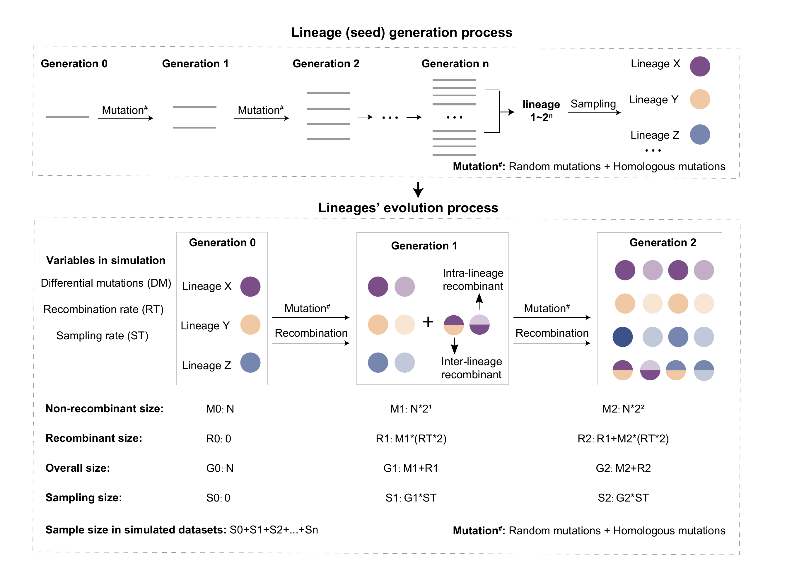
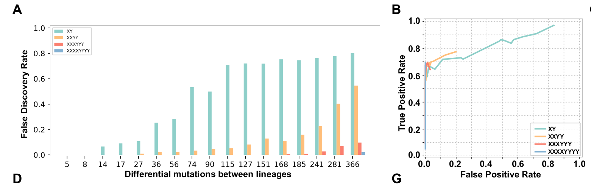
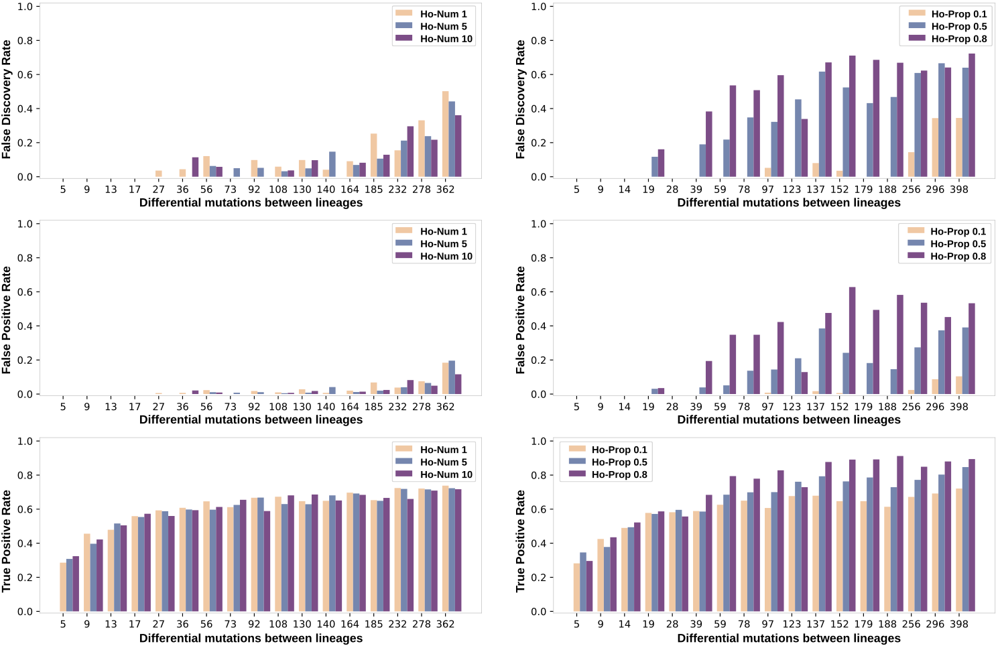

# CovRecomb_Simulation_Test
The simulation tests for the CovRecomb method by simulating SARS-CoV-2 evolution.

## Overview
A forward-evolution simulator called [CovSimulator](https://github.com/weigangq/cov-db/blob/master/scripts/CovSimulator.py) (Saymon Akther, 2021) was used to generate the simulation recombination dataset by considering the SARS-CoV-2 genome evolution and transmission. Based on the previous simulator, we made changes to meet the requirements of our simulation test.

### Two stages in simulation
The simulation was divided into two stages: (1) the initial lineage generation process and (2) the lineage evolution process. In the first stage, starting from the SARS CoV-2 Wuhan strain, the genome would experience n generations (G) to generate 2^n sequences. Then, we randomly sampled several sequences in the last generation and took them as the initial composition of viral lineages. In the second stage, apart from the similar evolution process as stage one, homologous inter-lineage and intra-lineage recombination would occur with a Poisson distributed rate of population size for each generation. We ensured that at least one inter-lineage recombinant and one intra-lineage recombinant occurred at each generation regardless of the population size. Notably, during each generation in the two stages, all genomes would mutate at random positions with the number of sites following the Poisson distribution. A preset proportion of sequences would share a preset number of homologous mutations, which would help to integrate the convergent evolution factor into the simulation.

### Analog and ideal simulation
To obtain a more realistic simulation of sample sequencing, two simulation conditions were carried out, including the ideal simulation and the analog simulation. The ideal simulation extracted all the generated sequences in each generation, while the analog simulation randomly selected sequences in a preset proportion. The main difference between these two simulations is that the parental lineages of the extracted recombinants may not be sampled simultaneously in the analog simulation, which is more similar to that of the real world. The missing parental lineages inevitably increased the difficulty for all recombinant detection methods, including CovRecomb and 3SEQ.

## Workflow

## CovRecomb_compare_3SEQ
The scripts and results for comparing the coverage rate of recombinants in (ideal and analog) simulation datasets between the 3SEQ and the CovRecomb method.

## CovRecomb_ROC
The scripts and results for calculating the false discovery rate (FDR) values and the receiver operating characteristic (ROC) curves for the CovRecomb method when using different numbers of sequential feature mutations.

## Convergent_evolution_effect
To evaluate whether and how convergent evolution affects CovRecomb, we tested the CovRecomb method for its false discovery rate (FDR), the false positive rate (FPR), and true positive rate (TPR) values in different homologous mutation numbers or proportions. The scripts and results are shown in the ([Convergent_evolution_effect/HOMO_number](https://github.com/wuaipinglab/CovRecomb_Simulation_Test/tree/main/Convergent_evolution_effect/HOMO_number)) folder and ([Convergent_evolution_effect/HOMO_probability](https://github.com/wuaipinglab/CovRecomb_Simulation_Test/tree/main/Convergent_evolution_effect/HOMO_probability)) folder, respectively.

## Acknowledgements
We would like to express our special thanks to the [CovSimulator](https://github.com/weigangq/cov-db/blob/master/scripts/CovSimulator.py) developers for their contributions in the field of simulation testing.
